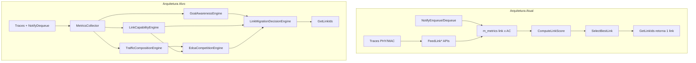
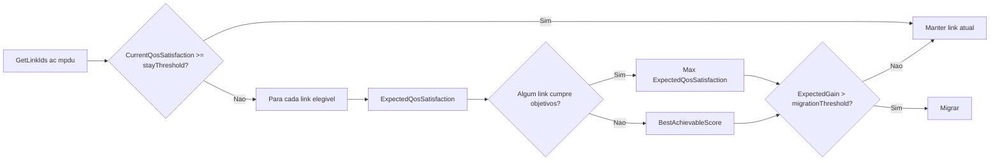

# Plano de Implementação: Goal-Oriented Traffic-Aware MLO Scheduler

## O que percebi do teu plano

Queres transformar o scheduler de **"qual link tem melhor score instantâneo?"** para **"estou a cumprir os objetivos QoS desta AC? Se não, qual link maximiza a probabilidade de os cumprir?"**, considerando capacidade real do link, composição de tráfego existente e competição EDCA — com histerese para evitar oscilações e um modo *Best Achievable QoS* quando os objetivos são impossíveis.

Confirmaste que o **escopo é AP-only (downlink)**; os schedulers das STAs ficam com lógica simplificada ou FCFS.

---

## Estado atual (gap analysis)

### Scheduler: [`scratch/mlo-qos-weighted-scheduler.h`](scratch/mlo-qos-weighted-scheduler.h)

O `QosWeightedMloScheduler` já tem uma base útil, mas está longe da arquitetura proposta:

| Aspeto | Estado atual | Gap |
|--------|-------------|-----|
| Objetivos QoS | `AcTargets` com delay/jitter/loss/throughput | Não calcula *satisfaction* nem distância aos objetivos; jitter nunca entra no score |
| Score | `ComputeLinkScore()` — utilidade parcial + heurísticas AC-específicas | Score é "custo" (menor = melhor), não índice de satisfação 0–1 |
| Capacidade | `MAX_THROUGHPUT * (1 - utilization)` quando throughput = 0 | Sem `estimatedCapacity`, `availableCapacity`, `freeAirtime` |
| PHY | Campos `currentMcs`, `averageSinr` em `LinkState` | **Nunca alimentados** |
| Composição tráfego | `packetsAssigned` por (link, AC) | Sem throughput/airtime/flows por AC por link |
| EDCA | Não existe | Sem `CompetitionPressure` nem `ExpectedAccessOpportunity` |
| Decisão | `SelectBestLink()` com histerese rudimentar (score ≥ 0.2, ganho 20%) | Sem "stay if satisfied", sem `ExpectedQosSatisfaction` |
| Métricas per-link | Throughput/PER por (link, AC) via traces | Delay/queue length replicados em **todos os links** no `NotifyEnqueue/Dequeue` — impreciso |



### Simulação: [`scratch/wifi7-mlo-multi-sta-priority-sch.cc`](scratch/wifi7-mlo-multi-sta-priority-sch.cc)

**Já alimenta o scheduler AP:**
- `AckedMpdu` → `FeedLinkMetrics` (bytes, sucesso)
- `PhyTxPsduBegin` → `FeedLinkTxAttempt` (PER)
- `PhyTxBegin/End` → `FeedLinkTxStart/End` (utilização)
- Drops → `FeedLinkDrop`

**Existe mas não alimenta o scheduler:**
- `RecordLinkTraffic` / `RecordFrameDistribution` — throughput por (link, AC) só para CSV
- `WifiTxVector` em `PhyTxPsduBegin` — MCS, channel width, duração PSDU (capacidade PHY)
- Jitter/delay por STA a nível de aplicação — não por (link, AC) no scheduler
- `FlowMonitor` — só pós-simulação

**STAs:** instalam o mesmo scheduler mas, com escopo AP-only, passarão a FCFS ou wrapper mínimo.

### ns-3.47 (infraestrutura relevante)

- Hook principal MLO: `WifiMacQueueScheduler::GetLinkIds()` — chamado em `Txop::Queue()` por MPDU
- STR = `EmlsrActivated=false` — TX concorrente em múltiplos links; decisão é **per-MPDU**
- Capacidade PHY estimável via `WifiMode::GetDataRate(const WifiTxVector&, staId)` ([`src/wifi/model/wifi-mode.cc`](src/wifi/model/wifi-mode.cc))
- EDCA params legíveis via `QosTxop::GetMinCw/GetMaxCw/GetAifsn(linkId)` ([`src/wifi/model/qos-txop.h`](src/wifi/model/qos-txop.h))
- Sem API unificada de QoS — métricas reais exigem traces + `NotifyDequeue` (como já fazes)

---

## Arquitetura alvo (refactor interno)

Manter a classe `QosWeightedMloScheduler` (evita quebrar o script), reorganizando em **5 motores privados** + **1 coletor de métricas**. Renomear conceitualmente para *Goal-Oriented* via comentários/doc; opcionalmente renomear a classe num passo final.

### Novas estruturas de dados

```cpp
// Fase 1 — substitui AcTargets semanticamente (manter alias/compat)
struct AcGoals {
    double targetThroughputMbps;
    double maxDelayMs;
    double maxJitterMs;
    double maxPacketLoss;
};

struct QosSatisfaction {
    double throughput{0}, delay{0}, jitter{0}, loss{0};
    double index{0};  // agregado 0..1
};

// Fase 2 — extensão de LinkState (nível link, partilhado entre ACs)
struct LinkCapability {
    double estimatedCapacityMbps{0};
    double availableCapacityMbps{0};
    double freeAirtime{0};       // 1 - channelUtilization
    double capabilityScore{0};   // 0..1
};

// Fase 3
struct LinkTrafficComposition {
    double voThroughput, viThroughput, beThroughput, bkThroughput;
    double voAirtime, viAirtime, beAirtime, bkAirtime;
    uint32_t voFlows, viFlows, beFlows, bkFlows;
};

// Fase 4 — por (link, AC candidata)
struct EdcaCompetition {
    double competitionPressure{0};
    double expectedAccessOpportunity{0};  // 0..1
    double effectiveAvailableCapacityMbps{0};
};
```

Estado interno proposto:

```cpp
std::map<uint8_t, AcGoals> m_goals;                          // por AC
std::map<uint8_t, QosSatisfaction> m_currentSatisfaction;    // por AC (link atual)
std::map<uint8_t, LinkCapability> m_linkCapability;            // por link
std::map<uint8_t, LinkTrafficComposition> m_traffic;           // por link
std::map<uint8_t, std::map<uint8_t, EdcaCompetition>> m_edca;  // link -> ac
```

### Pipeline de decisão (Fases 5+6)



---

## Fases de implementação

### Fase 0 — Preparação e limpeza (pré-requisito)

**Ficheiro:** [`scratch/mlo-qos-weighted-scheduler.h`](scratch/mlo-qos-weighted-scheduler.h)

- Remover/comentar código morto (3 versões de `ComputeLinkScore`/`SelectBestLink` comentadas — ~400 linhas)
- Separar métricas **globais por AC** (`m_acStates`) de métricas **por (link, AC)** (`m_metrics`)
- Corrigir `NotifyEnqueue/Dequeue`: delay/jitter/queue length devem atualizar apenas o **link onde o MPDU foi efetivamente transmitido** (inferir via `m_lastSelectedLink[ac]` ou novo `FeedPacketTx(linkId, ac, delayMs)` no `AckedMpdu`)
- Adicionar `SetGoals()` (alias de `SetTargets`) e parâmetros TypeId configuráveis: `StayThreshold`, `MigrationThreshold`, `MetricsInterval`

**Ficheiro:** [`scratch/wifi7-mlo-multi-sta-priority-sch.cc`](scratch/wifi7-mlo-multi-sta-priority-sch.cc)

- AP: manter `QosWeightedMloScheduler`
- STAs: substituir por `FcfsWifiQueueScheduler` (ou wrapper mínimo sem lógica goal-oriented)

---

### Fase 1 — Goal-Awareness Engine

**Objetivo:** `ComputeQosSatisfaction(ac, linkId)` → `QosSatisfaction` com índice 0..1.

**Implementação:**

1. Renomear `AcTargets` → `AcGoals` (campo `minThroughputMbps` → `targetThroughputMbps`)
2. Calcular satisfações normalizadas reutilizando `UtilityFunction` existente (já produz 0..1 com sigmoid):
   - `throughputSatisfaction = UtilityFunction(achieved, target, lowerIsBetter=false)`
   - `delaySatisfaction = UtilityFunction(delay, maxDelay, lowerIsBetter=true)`
   - `jitterSatisfaction = UtilityFunction(jitter, maxJitter, lowerIsBetter=true)`
   - `lossSatisfaction = UtilityFunction(loss, maxLoss, lowerIsBetter=true)`
3. `ComputeQosSatisfaction`: média ponderada usando `AcWeights` existentes (delay/jitter/loss/tp) — **finalmente usar os weights que hoje estão definidos mas ignorados**
4. `m_currentSatisfaction[ac]` atualizado em `UpdatePeriodicMetrics()` para o **link atual** (`m_lastSelectedLink`)
5. Adicionar tracking de jitter no scheduler: EWMA de `|delay_i - delay_{i-1}|` por AC em `NotifyDequeue` (não depender só do FlowMonitor)

**Saída:** `CurrentQosSatisfaction` por AC, usado na Fase 5.

---

### Fase 2 — Link Capability Engine

**Objetivo:** Capacidade intrínseca por link, independente de quem o usa.

**Novas APIs de feed (simulação → scheduler):**

```cpp
void FeedLinkPhyState(uint8_t linkId, const WifiTxVector& txVector, double per);
// opcional: void FeedLinkSinr(uint8_t linkId, double sinrDb);
```

**Cálculo (em `UpdatePeriodicMetrics` ou no feed):**

```text
estimatedCapacityMbps = WifiMode::GetDataRate(txVector) * (1 - PER) / 1e6
occupiedCapacityMbps  = suma throughput de todas as ACs no link (Fase 3)
availableCapacityMbps = max(0, estimated - occupied)
freeAirtime           = 1.0 - channelUtilization
capabilityScore       = normalizar(availableCapacity / estimatedCapacity)
```

- Manter EWMA do último MCS/channel width/PER por link (média móvel dos TXs)
- Se link sem TX recente: usar último estado PHY conhecido (não `MAX_THROUGHPUT` estático)

**Alteração no script:** em `LinkPhyTxPsduBeginCallback`, extrair `txVector.GetMode()`, channel width e chamar `FeedLinkPhyState`.

---

### Fase 3 — Traffic Composition Engine

**Objetivo:** Composição exata do tráfego por link (AP conhece tudo).

**Abordagem preferida — recolha interna no scheduler** (evita duplicar lógica do script):

Novo callback:

```cpp
void FeedPacketTransmitted(uint8_t linkId, AcIndex ac, uint32_t bytes,
                           double airtimeSec, Mac48Address peer, uint8_t tid);
```

Chamado a partir de:
- `RecordLinkTrafficFromMpdu` (já tem linkId, AC, bytes)
- `LinkPhyTxPsduBeginCallback` — duração PSDU como proxy de airtime por AC

**Acumulação (janela `m_metricsIntervalSec`):**
- Throughput por AC: bytes TX / dt
- Airtime por AC: soma durações PHY TX atribuídas à AC
- Flows por AC: `std::set<std::tuple<Mac48Address, uint8_t>>` por (link, AC)

**Saída:** `m_traffic[linkId]` resetada a cada janela periódica.

**Nota:** O CSV `g_linkTrafficData` pode manter-se para análise offline; a fonte de verdade para o scheduler passa a ser `FeedPacketTransmitted`.

---

### Fase 4 — EDCA Competition Engine

**Objetivo:** Pressão de competição e capacidade efetiva para a AC candidata.

**Implementação:**

1. Matriz de pesos configurável (defaults do teu plano):

| AC candidata | VO | VI | BE | BK |
|---|---|---|---|---|
| BE | 4 | 2 | 1 | 0.5 |
| VI | 2 | 1 | 0.5 | 0.25 |
| VO | 1 | 0.25 | 0.05 | 0 |

2. `CompetitionPressure(ac, link) = Σ weight[ac][otherAc] * normalizedLoad(otherAc, link)`
   - `normalizedLoad` = fração de airtime ou throughput relativo no link
3. `ExpectedAccessOpportunity` — modelo inicial simples e calibrável:

```text
opportunity = freeAirtime / (1 + competitionPressure)
// clamp 0..1; opcionalmente refinar com AIFSN/CW via QosTxop::GetAifsn(linkId)
```

4. `EffectiveAvailableCapacity = availableCapacity * opportunity`

**Saída:** `m_edca[linkId][ac]` recalculado em `UpdatePeriodicMetrics()`.

---

### Fase 5 — Link Migration Decision Engine

**Substituir** `SelectBestLink()` + `ComputeLinkScore()` por:

```cpp
double ComputeExpectedQosSatisfaction(AcIndex ac, uint8_t linkId) const;
uint8_t DecideLinkMigration(AcIndex ac, const std::list<uint8_t>& eligible);
```

**Lógica:**

1. `currentSat = m_currentSatisfaction[ac].index`
2. Se `currentSat >= m_stayThreshold` (default ~0.85) → **manter** `m_lastSelectedLink[ac]`
3. Senão, para cada link elegível calcular `expectedSat` usando:
   - Satisfação projetada de throughput: `UtilityFunction(effectiveAvailableCapacity, target, false)` ponderada pela fração de capacidade que a AC pode obter
   - Delay/jitter/loss projetados: extrapolar a partir do estado atual + carga adicional estimada no link
   - Penalização por PER e `capabilityScore`
4. Selecionar `argmax(expectedSat)`
5. Histerese: migrar só se `expectedSat - currentSat > m_migrationThreshold` (default ~0.15)
6. Logging CSV expandido: satisfação atual, esperada, pressão EDCA, capacidade efetiva, motivo da decisão (STAY_SATISFIED / STAY_HYSTERESIS / MIGRATE_GAIN)

**Inversão de convenção:** passar de "score mínimo" para "satisfação máxima" — importante para legibilidade e alinhamento com o plano.

---

### Fase 6 — Best Achievable QoS Mode

Integrar como **branch dentro de `DecideLinkMigration`** (não fase separada de código):

```cpp
bool AnyLinkMeetsGoals(AcIndex ac, const std::list<uint8_t>& links) const;
double ComputeBestAchievableScore(AcIndex ac, uint8_t linkId) const;
```

- `AnyLinkMeetsGoals`: verifica se `expectedSat >= 1.0` (ou threshold por métrica individual) em algum link
- Se **nenhum** cumpre: usar `BestAchievableScore` = combinação ponderada de throughput efetivo esperado, delay/jitter/loss projetados e competição — **sem exigir atingir targets**
- Evita oscilação: mesmo no modo best-effort, manter histerese de migração

---

## Alterações na simulação (checklist)

**Ficheiro:** [`scratch/wifi7-mlo-multi-sta-priority-sch.cc`](scratch/wifi7-mlo-multi-sta-priority-sch.cc)

| Métrica | Ação |
|---------|------|
| Throughput por link/AC | Unificar `FeedLinkMetrics` + novo `FeedPacketTransmitted` |
| Airtime por link/AC | Correlacionar `PhyTxPsduBegin` (duração) com AC |
| Flows por AC | Contar `(peer, tid)` no feed |
| PER por link | Já existe via `FeedLinkTxAttempt` + `FeedLinkMetrics` |
| MCS / channel width | Novo `FeedLinkPhyState` em `PhyTxPsduBegin` |
| SINR | Opcional: trace `MonitorSnifferRx` no AP ou média do `WifiRemoteStationManager` |
| Delay / jitter por AC | Scheduler interno (`NotifyDequeue`) + feed no link correto via `AckedMpdu` |
| STAs | Remover instalação de `QosWeightedMloScheduler`; usar FCFS |

**Novos parâmetros de linha de comando (opcional):** `--stayThreshold`, `--migrationThreshold`, `--qosGoalsFile` para objetivos por AC.

---

## Ordem de implementação recomendada

```mermaid
gantt
    title Ordem de Implementacao
    dateFormat X
    axisFormat %s

    section Fundacao
    Fase0_Limpeza_PerLinkMetrics    :0, 1
    Fase1_GoalEngine                :1, 2
    section Metricas
    Fase3_TrafficComposition        :2, 3
    Fase2_LinkCapability            :3, 4
    section Decisao
    Fase4_EDCA                      :4, 5
    Fase5_Migration                 :5, 6
    Fase6_BestAchievable            :6, 7
    section Validacao
    Script_Wiring_AP_only           :3, 7
    Testes_Regressao                :7, 8
```



Ordem lógica: **0 → 1 → 3 → 2 → 4 → 5+6 → validação**

(Fase 3 antes da 2 porque `occupiedCapacity` depende da composição de tráfego.)

---

## Estratégia de validação

1. **Teste de regressão funcional:** compilar e correr `wifi7-mlo-multi-sta-priority-sch` com scheduler ativo; verificar que não há crash e que CSV de decisões é produzido
2. **Teste de comportamento VO:** cenário com tráfego VO+BE; verificar que VO permanece no link rápido quando satisfeito e migra quando PER/delay degradam
3. **Teste de histerese:** degradar link atual ligeiramente; confirmar que não há flip-flop entre links
4. **Teste Best Achievable:** objetivos impossíveis (ex. `targetThroughputMbps=800` com links ~300/500); confirmar escolha estável do melhor link possível
5. **Comparar CSV:** `m_decisionCsv` expandido vs `g_linkTrafficData` — consistência throughput/airtime por link/AC

---

## Riscos e decisões de desenho

| Risco | Mitigação |
|-------|-----------|
| Delay/jitter globais replicados em todos os links | Fase 0: associar métricas ao link de TX real |
| `NotifyDequeue` não sabe o link | Usar `AckedMpdu` como fonte primária de delay end-to-end no link |
| Airtime por AC impreciso em MU-MIMO | Inicialmente contar só SU-TX; MU como melhoria posterior |
| Modelo EDCA simplificado vs realidade | Pesos configuráveis; calibrar com `WifiCoTraceHelper` offline |
| Ficheiro header monolítico (1251 linhas) | Refactor incremental; opcional extrair motores para `scratch/mlo-scheduler-engines.h` se crescer demais |

---

## Ficheiros a modificar

| Ficheiro | Alterações |
|----------|-----------|
| [`scratch/mlo-qos-weighted-scheduler.h`](scratch/mlo-qos-weighted-scheduler.h) | Arquitetura completa: estruturas, 5 motores, nova lógica de decisão, novos feeds |
| [`scratch/wifi7-mlo-multi-sta-priority-sch.cc`](scratch/wifi7-mlo-multi-sta-priority-sch.cc) | Wiring AP-only, novos feeds PHY/airtime/flows, STAs → FCFS |
| (opcional) `scratch/mlo-scheduler-engines.h` | Extrair motores se o header ficar >1500 linhas |

**Sem alterações no core ns-3** — tudo via `WifiMacQueueScheduler` override + traces, como já fazes.
